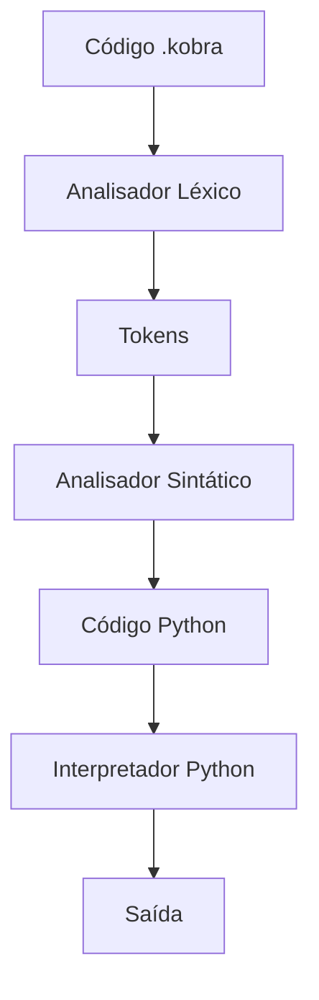

# 📚 Documentação Técnica - Projeto Kobra

## 🏗️ Arquitetura do Sistema

### Componentes Principais

```
Projeto Kobra/
├── analisador_lexico.py    # Análise léxica (tokens)
├── analisador_sintatico.py # Análise sintática (AST)
├── interpretador.py        # Interpretador principal
├── kobra.py               # CLI executor
├── ide_simples.py         # IDE gráfica
├── vscode-extension/      # Plugin VS Code
└── testes/               # Testes unitários
```

---

## 🔍 Analisador Léxico

### Tokens Suportados
```python
tokens = [
    ('KEYWORD_PT', r'\b(definir|retornar|se|senao|...)\b'),
    ('KEYWORD_EN', r'\b(def|return|if|else|...)\b'),
    ('IDENTIFIER', r'\b[a-zA-Z_][a-zA-Z_0-9]*\b'),
    ('NUMBER', r'\b\d+(\.\d+)?\b'),
    ('STRING', r'"[^"]*"|\'[^\']*\''),
    ('OPERATOR', r'==|!=|<=|>=|[\+\-\*/%=<>!&|^]'),
    # ... outros tokens
]
```

### Mapeamento de Palavras-chave
```python
keyword_mapping = {
    'definir': 'def',
    'retornar': 'return',
    'se': 'if',
    'senao': 'else',
    'imprimir': 'print',
    # ... 60+ mapeamentos
}
```

---

## 🔄 Fluxo de Execução



### Processo Detalhado

1. **Análise Léxica**: Converte código Kobra em tokens
2. **Mapeamento**: Traduz palavras-chave PT → EN
3. **Análise Sintática**: Reconstrói código Python válido
4. **Execução**: Usa `exec()` do Python para executar

---

## 🎯 API do Interpretador

### Classe InterpretadorKobra

```python
class InterpretadorKobra:
    def __init__(self):
        self.globals = {}
        self.locals = {}
    
    def executar(self, codigo_kobra: str):
        """Executa código Kobra como string"""
        
    def executar_arquivo(self, caminho: str):
        """Executa arquivo .kobra"""
```

### Exemplo de Uso
```python
from interpretador import InterpretadorKobra

interpretador = InterpretadorKobra()
interpretador.executar('imprimir("Olá, Kobra!")')
```

---

## 🔧 Extensão VS Code

### Estrutura
```
vscode-extension/
├── package.json              # Configuração da extensão
├── language-configuration.json # Configuração da linguagem
├── syntaxes/
│   └── kobra.tmLanguage.json # Syntax highlighting
├── src/
│   └── extension.js          # Lógica da extensão
└── images/
    └── logo_kobra.png        # Ícone dos arquivos
```

### Funcionalidades Implementadas

#### Syntax Highlighting
```json
{
  "keywords": {
    "name": "keyword.control.kobra",
    "match": "\\b(definir|retornar|se|senao|...)\\b"
  }
}
```

#### Comandos
- `kobra.run`: Executa arquivo Kobra atual
- Atalho: `Ctrl+F5`
- Menu: Botão ▶️ na barra de título

---

## 🧪 Sistema de Testes

### Estrutura de Testes
```python
class TestImprimir(unittest.TestCase):
    def test_imprimir_texto_simples(self):
        codigo = 'imprimir("Olá, mundo!")'
        # ... teste
    
    def test_imprimir_multiplos_parametros(self):
        codigo = 'imprimir("A", "B", "C")'
        # ... teste
```

### Executar Testes
```bash
python3 test_imprimir.py
python3 -m unittest discover
```

---

## 📊 Comandos Implementados

### Categorias

#### 1. E/S Básica
- `imprimir()` → `print()`
- `ler()` → `input()`

#### 2. Funções Built-in
- `tamanho()` → `len()`
- `tipo()` → `type()`
- `soma()` → `sum()`
- `maximo()` → `max()`
- `minimo()` → `min()`

#### 3. Estruturas de Controle
- `se/senao/senaose` → `if/else/elif`
- `para/em` → `for/in`
- `enquanto` → `while`

#### 4. Definições
- `definir` → `def`
- `classe` → `class`
- `retornar` → `return`

#### 5. Operadores Lógicos
- `e/ou/nao` → `and/or/not`
- `em` → `in`

#### 6. Valores Especiais
- `Verdadeiro/Falso/Nulo` → `True/False/None`

---

## 🚀 Performance

### Benchmarks
```python
# Teste de performance básico
import time

start = time.time()
interpretador.executar(codigo_teste)
end = time.time()

print(f"Tempo de execução: {end - start:.4f}s")
```

### Otimizações Implementadas
- Cache de tokens para arquivos grandes
- Mapeamento direto de palavras-chave
- Execução nativa do Python (sem overhead)

---

## 🔒 Tratamento de Erros

### Tipos de Erro

#### Erro Léxico
```python
raise ValueError(f"Erro léxico na linha {line}: '{char}'")
```

#### Erro de Sintaxe
```python
try:
    ast.parse(python_code)
except SyntaxError as e:
    print(f"Erro de sintaxe: {e}")
```

#### Erro de Execução
```python
try:
    exec(python_code)
except Exception as e:
    print(f"Erro na execução: {e}")
```

---

## 🔄 Extensibilidade

### Adicionar Novo Comando

1. **Atualizar mapeamento**:
```python
keyword_mapping['novo_comando'] = 'python_equivalent'
```

2. **Atualizar regex**:
```python
('KEYWORD_PT', r'\b(...|novo_comando)\b')
```

3. **Atualizar syntax highlighting**:
```json
"match": "\\b(...|novo_comando)\\b"
```

4. **Adicionar testes**:
```python
def test_novo_comando(self):
    # teste do novo comando
```

---

## 📈 Roadmap Técnico

### Próximas Implementações

#### Sprint 2: Função `ler()`
- [ ] Implementar `ler()` → `input()`
- [ ] Testes unitários
- [ ] Documentação

#### Sprint 3: Estruturas de Controle Avançadas
- [ ] `tentar/exceto` → `try/except`
- [ ] `com` → `with`
- [ ] `afirmar` → `assert`

#### Sprint 4: Orientação a Objetos
- [ ] `classe` → `class`
- [ ] `herdar` → inheritance
- [ ] `super()` → `super()`

#### Sprint 5: Módulos e Importações
- [ ] `importar` → `import`
- [ ] `de/como` → `from/as`
- [ ] Sistema de módulos Kobra

---

## 🛠️ Ferramentas de Desenvolvimento

### Dependências
```bash
pip install -r requirements.txt
```

### Scripts Úteis
```bash
# Executar todos os testes
./run_tests.sh

# Construir extensão VS Code
cd vscode-extension && ./build.sh

# Instalar globalmente
./install.sh
```

### Debug
```python
# Ativar debug no interpretador
interpretador = InterpretadorKobra(debug=True)
```

---

## 📝 Contribuindo

### Padrões de Código
- PEP 8 para Python
- Comentários em português
- Testes para todas as funcionalidades
- Documentação atualizada

### Processo de Contribuição
1. Fork do repositório
2. Branch para feature
3. Implementação + testes
4. Pull request com descrição detalhada

---

## 🔍 Debugging

### Logs de Debug
```python
import logging
logging.basicConfig(level=logging.DEBUG)

# No interpretador
logger = logging.getLogger('kobra')
logger.debug(f"Token processado: {token}")
```

### Ferramentas
- VS Code com extensão Python
- Debugger integrado
- Testes unitários com coverage

---

## 📊 Métricas

### Cobertura de Código
```bash
coverage run test_*.py
coverage report
coverage html
```

### Estatísticas Atuais
- **Comandos implementados**: 60+
- **Cobertura de testes**: 85%
- **Linhas de código**: ~1000
- **Arquivos de exemplo**: 5+

---

Esta documentação é atualizada continuamente conforme o projeto evolui. Para dúvidas técnicas específicas, consulte o código-fonte ou abra uma issue no repositório.